<div align="center">



# ASK Token Optimizer

**Stop paying for tokens Claude never needed to see.**

*Proprietary binary · licensed under [Community / Commercial terms](LICENSE) · free under USD $100k annual revenue*

<!-- dynamic — update automatically from GitHub -->
[](https://github.com/ASK-Ai-Canada/ASK-Claude-Token-Optimizer/stargazers)
[](https://github.com/ASK-Ai-Canada/ASK-Claude-Token-Optimizer/network/members)
[](https://github.com/ASK-Ai-Canada/ASK-Claude-Token-Optimizer/releases)
[](https://github.com/ASK-Ai-Canada/ASK-Claude-Token-Optimizer/releases/latest)
[](https://github.com/ASK-Ai-Canada/ASK-Claude-Token-Optimizer/issues)

<!-- static — stack + platform · for-the-badge = beveled rounded pills -->


<br/>

[](https://github.com/ASK-Ai-Canada/ASK-Claude-Token-Optimizer/releases/latest)&nbsp;
[](#install--linux--windows--pi4)&nbsp;
[](#performance--live-audit-data)&nbsp;
[](mailto:licensing@ask-ai.ca)

</div>

---

## The problem

Every time Claude Code runs a command — `git status`, `grep`, `ls`, `cargo build` — the full output lands in the context window. A single grep across a large codebase can dump **250,000 tokens of noise** that Claude processes, charges you for, and largely ignores.

That's not a Claude problem. That's a plumbing problem. And it's solvable before it reaches Claude.

---

## What ASK Token Optimizer does

It sits between your terminal and Claude Code as two lightweight hooks. Before Claude sees a command's output, the optimizer filters it — stripping noise, collapsing repetition, keeping only what Claude actually needs to reason about. The output is structurally identical; the token count is not.

```
Without optimizer:
  git status  →  raw output  →  Claude sees 1,200 tokens

With optimizer:
  git status  →  filtered     →  Claude sees 110 tokens
                                              ↑
                                        92% fewer tokens.
                                        Same information.
```

No API key. No cloud. No account. The optimizer runs locally, processes output on your machine, and never touches the network.

---

## Performance — live audit data

*Measured on a real Claude Code session: 351 commands over 30 days. Source: `ask gain`.*

### Maximum savings — by command type

*Figures are averages across all runs of that command type in a 30-day session. See [honest audit](#why-we-show-you-the-honest-number-too) below for steady-state numbers.*

| Command type | Tokens saved |
|---|---|
| `grep` (large codebases) | **98.9%** |
| `curl` (external API responses) | **95.7%** |
| `git push` | **92.8%** |
| `find` | **92.2%** |
| `curl` (local service responses) | **77–87%** |
| `ls` | **64.7%** |
| **Session total — 30 days, 351 commands** | **87.7%** |

> 340,000 input tokens compressed to 41,800 delivered to Claude.

### Why we show you the honest number too

The 87.7% session figure is real. But one command — a single grep run — produced 250,000 tokens of output and accounts for 93% of all savings in that figure. Remove that one outlier and measure the remaining 335 commands in steady-state:

| | Headline (raw) | Steady-state |
|---|---|---|
| Commands | 351 | 335 |
| Compression | **87.7%** | **56.2%** |
| Tokens in | 340K | 70.5K |
| Tokens saved | 298.5K | 39.6K |

**What this tells you:** ASK Token Optimizer is highly effective on high-volume output (grep, curl, build logs, large diffs) — those are the commands burning most of your budget anyway. On short-output commands (git status, quick reads) it compresses less. Your own workload will land somewhere between these two figures. Run `ask gain` after a day of use to see your real number.

We show both because you deserve to know what you're actually buying.

---

## Licensing — free under $100k, commercial above

A single codebase. Two licenses. The engine is identical in both tiers — nothing is locked or degraded in the free version.

| | **Community** | **Commercial** |
|---|---|---|
| Who | Individuals + companies under **USD $100k** annual revenue | Companies at or above **USD $100k** for business use |
| Cost | Free, forever | By company size — not per seat, token, or compute |
| Engine | Full, unlimited | Same engine |
| Support | Community | SLA · priority fixes · dedicated contact · private channel |
| Additional rights | — | Internal redistribution · version pinning · security docs *(roadmap)* |

> Installing or running the software constitutes acceptance of the [LICENSE](LICENSE). Governing law: Canada. Commercial licensing: **licensing@ask-ai.ca**

---

## Install — Linux / Windows / Pi4

Download or clone the SDK, then from its directory:

```bash
./setup.sh
```

Installs the binary, creates the `ask` shortcut, stages hook templates, and verifies. If no pre-built binary matches your platform and Rust is installed, it builds from source automatically.

## Install — Windows (no WSL required)

```powershell
.\install.ps1
```

Copies the binary to `%USERPROFILE%\.local\bin`, adds it to PATH, stages hooks. Full guide: **[INSTALL-WINDOWS.md](INSTALL-WINDOWS.md)**.

---

## Activate the hooks (one time)

The optimizer only runs once the two hooks are wired into Claude Code. Edit `~/.claude/settings.json` (Linux / Windows / Pi4) or `%USERPROFILE%\.claude\settings.json` (Windows):

**Linux / Windows / Pi4:**
```jsonc
{
  "hooks": {
    "PreToolUse":  [ { "matcher": "Bash", "hooks": [ { "type": "command", "command": "$HOME/.claude/hooks/ask-rewrite.sh" } ] } ],
    "PostToolUse": [ { "matcher": "Bash", "hooks": [ { "type": "command", "command": "$HOME/.claude/hooks/ask-filter.sh" } ] } ]
  }
}
```

**Windows:**
```jsonc
{
  "hooks": {
    "PreToolUse":  [ { "matcher": "Bash", "hooks": [ { "type": "command", "command": "python %USERPROFILE%\\.claude\\hooks\\ask-rewrite.py" } ] } ],
    "PostToolUse": [ { "matcher": "Bash", "hooks": [ { "type": "command", "command": "python %USERPROFILE%\\.claude\\hooks\\ask-filter.py" } ] } ]
  }
}
```

Restart Claude Code, then confirm it's working:

```bash
ask gain
```

---

## SDK contents

```
.
├── builds/
│   ├── linux-x86_64/         ← pre-built binary, Linux x86_64
│   ├── linux-arm64/          ← pre-built binary, Linux arm64
│   └── windows-x86_64/       ← pre-built binary, Windows x86_64 (.exe)
├── hooks/                    ← Claude Code hook templates (fork freely)
├── setup.sh                  ← Linux / Windows / Pi4 installer
├── install.ps1               ← Windows installer
├── INSTALL-WINDOWS.md        ← full Windows guide
├── ask-token-optimizer.service   ← optional: run as a system service
├── .env.example              ← optional configuration
├── LICENSE
└── README.md
```

---

## CLI reference

```
ask --version          Version info
ask gain               Your cumulative savings since install
ask gain --graph       Daily savings trend
ask <command> <args>   Run any supported command through the optimizer
ask --hook             Compression endpoint used by the hooks
ask rewrite <cmd>      Preview how a command would be rewritten
ask serve --port N     Optional HTTP service mode (POST /v1/compress/output)
```

Supported commands: `git · ls · tree · grep · find · cargo · npm · pnpm · aws · psql · gh · read · diff · json · deps · env` — and more. Run `ask --help` for the full list.

---

## Configuration (optional)

Copy `.env.example` → `.env`. Everything defaults to local-only operation.

| Key | Default | Purpose |
|---|---|---|
| `COMPRESS_THRESHOLD` | 500 chars | Minimum output size before compression engages |
| `WEBHOOK_URL` | — | POST audit events to your own endpoint (fleet dashboards, compliance) |
| `INFERENCE_URL` | `127.0.0.1:8091` | Optional: your own local LLM endpoint for deep summarization |
| `LISTEN_ADDR` | `127.0.0.1:8095` | Bind address when running in service mode |

No key ever points at Anthropic or any third-party service. Local by default. Inference is opt-in and runs wherever you point it.

---

## Claude Code setup — copy-paste guide

**Five steps, under two minutes.** Open a terminal in the SDK directory.

### Step 1 — Install

```bash
# Linux / Windows / Pi4
./setup.sh

# Windows (PowerShell)
.\install.ps1
```

The installer asks to wire the hooks for you. If you say yes, skip to Step 4.

---

### Step 2 — Verify the binary is on PATH

```bash
ask --version
# should print: ask-token-optimizer 0.4.2
```

If `ask: command not found`, add to your shell profile:

```bash
export PATH="$HOME/.local/bin:$PATH"
```

---

### Step 3 — Wire the hooks

Open (or create) `~/.claude/settings.json` and add the `hooks` block:

```jsonc
{
  "hooks": {
    "PreToolUse": [
      {
        "matcher": "Bash",
        "hooks": [
          { "type": "command", "command": "$HOME/.claude/hooks/ask-rewrite.sh" }
        ]
      }
    ],
    "PostToolUse": [
      {
        "matcher": "Bash",
        "hooks": [
          { "type": "command", "command": "$HOME/.claude/hooks/ask-filter.sh" }
        ]
      }
    ]
  }
}
```

**Windows** — replace the two `command` values with:
```
"python %USERPROFILE%\\.claude\\hooks\\ask-rewrite.py"
"python %USERPROFILE%\\.claude\\hooks\\ask-filter.py"
```

---

### Step 4 — Restart Claude Code

Close and reopen Claude Code (or reload the window). The hooks activate on restart.

---

### Step 5 — Confirm it's working

Run a few commands inside a Claude Code session, then:

```bash
ask gain
```

You should see token savings logged. A fresh install with no commands yet will show 0 — that's normal.

---

## Troubleshooting

| Symptom | Fix |
|---|---|
| `ask: command not found` | `~/.local/bin` not on PATH — run `export PATH="$HOME/.local/bin:$PATH"` or restart your shell |
| Hooks not firing | Restart Claude Code after editing `settings.json` |
| `ask gain` shows 0 | Run a few commands first — `git status`, `ls -la`, then check again |
| Windows: `ask` not recognized | Open a new PowerShell window after the PATH change |

---

## FAQ

**Is it safe to install?**
Yes. The optimizer only intercepts Bash tool output inside Claude Code. It does not touch your files, credentials, or environment. The hooks degrade safely — if the binary is missing or crashes, output passes through to Claude untouched.

**Does it change what Claude does?**
No. Claude receives the same factual content, in fewer tokens. Filtered output is structurally accurate — noise and repetition are removed, not meaning.

**Will it break my workflow?**
Unsupported commands pass through unchanged. If a command's output looks wrong after filtering, run `ask rewrite <cmd>` to preview the transformation, or add it to the exclusion list in `.env`.

**What happens to my data?**
Nothing leaves your machine. Compression is entirely local. The `history.db` savings ledger lives at `~/.local/share/ask/history.db` — readable with any SQLite viewer.

---

## How it compares

### ASK Token Optimizer vs RTK (its predecessor)

RTK (RustTokenKiller) was the original hook-based command-output compressor. ASK Token Optimizer is its successor — same architecture, rebuilt and extended. If you used RTK, here is what changed.

| | **RTK** | **ASK Token Optimizer** |
|---|---|---|
| **Architecture** | PreToolUse hook, per-command filters | Same — forward-compatible, same `rtk_cmd` DB column |
| **Compression** | Unmeasured (no audit) | **98.9% peak · 87.7% session · 56.2% steady-state** — measured from your own `history.db` |
| **Audit trail** | None | `history.db` · per-command savings · `ask gain` · `--by-version` timeline |
| **Version tracking** | None | `version` column in DB — every row stamped with the binary version that recorded it |
| **Hook safety** | Flag-hijack bug (`--version` inside any `rewrite` payload corrupted the command) | **Fixed in v0.4.2** — flag parsing restricted to first arg only; hook validates output before substituting |
| **Honest audit** | No inflation detection | §9 cap-based inflation check · steady-state vs headline · per-version epoch breakdown |
| **License** | None | Dual: Community (free under $100k) / Commercial |
| **Install** | Manual | `./setup.sh` · interactive hook auto-wire · PATH check |
| **Platforms** | Linux x86_64 | Linux x86_64 · Linux arm64 (Pi4) · Windows x86_64 |

Your existing RTK `history.db` is fully compatible — the DB schema is a strict superset. Installing ATO adds the `version` column automatically on first run without touching existing rows.

---

## Support

Community support for the free tier. Commercial customers: SLA-backed support, include `ask --version` in any issue report. **licensing@ask-ai.ca**

---

<div align="center">

**ASK Token Optimizer** · by **ASK AI** · [LICENSE](LICENSE) · Free under $100k · Commercial above

</div>
