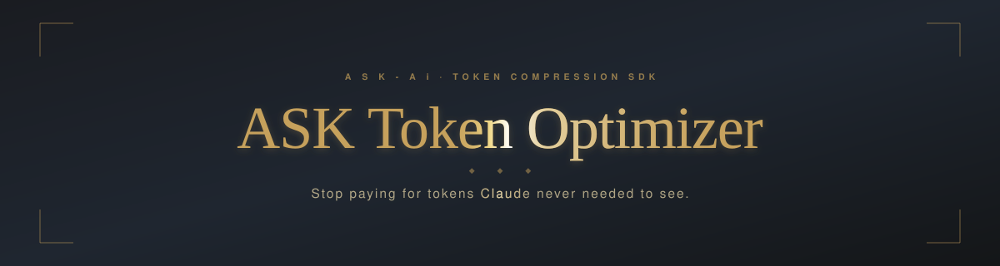
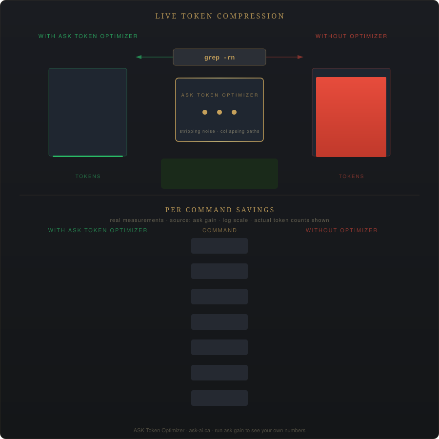

<div align="center">



# ATO

> ATO is a **freemium** product from **ASK AI** — free for individuals and teams under CAD $100K, commercially licensed above. Proceeds from enterprise licensing go toward raising technology literacy in local communities and paying independent developers through our bounty program. Every commercial seat helps fund someone else's first commit.
>
> *— ASK-Ai Team Canada*

**Stop paying for tokens Claude never needed to see.**

*Proprietary binary · licensed under [Community / Commercial terms](LICENSE) · free under CAD $100K annual revenue*

<!-- dynamic — update automatically from GitHub -->
[](https://github.com/ASK-Ai-Canada/ASK-Claude-Token-Optimizer/stargazers)
[](https://github.com/ASK-Ai-Canada/ASK-Claude-Token-Optimizer/network/members)
[](https://github.com/ASK-Ai-Canada/ASK-Claude-Token-Optimizer/releases)
[](https://github.com/ASK-Ai-Canada/ASK-Claude-Token-Optimizer/releases/latest)
[](https://github.com/ASK-Ai-Canada/ASK-Claude-Token-Optimizer/issues)

<!-- static — stack + platform · for-the-badge = beveled rounded pills -->


<br/>

[](https://github.com/ASK-Ai-Canada/ASK-Claude-Token-Optimizer/releases/latest)&nbsp;
[](README-LLM-install-guide.md)&nbsp;
[](#performance--live-audit-data)&nbsp;
[](mailto:licensing@ask-ai.ca)

</div>

---

## The problem

Every time Claude Code runs a command — `git status`, `grep`, `ls`, `cargo build` — the full output lands in the context window. A single grep across a large codebase can dump **250,000 tokens of noise** that Claude processes, charges you for, and largely ignores.

That's not a Claude problem. That's a plumbing problem. And it's solvable before it reaches Claude.

---

## What ASK Token Optimizer does

It sits between your terminal and Claude Code as two lightweight hooks. Before Claude sees a command's output, the optimizer filters it — stripping noise, collapsing repetition, keeping only what Claude actually needs to reason about. The output is structurally identical; the token count is not.

```
Without optimizer:
  git status  →  raw output  →  Claude sees 1,200 tokens

With optimizer:
  git status  →  filtered     →  Claude sees 110 tokens
                                              ↑
                                        92% fewer tokens.
                                        Same information.
```

No API key. No cloud. No account. The optimizer runs locally, processes output on your machine, and never touches the network.

---

## Licensing — free under $100K, commercial above

A single codebase. Two licenses. The engine is identical in both tiers — nothing is locked or degraded in the free version.

| | **Community** | **Commercial** |
|---|---|---|
| Who | Individuals + companies under **CAD $100K** annual revenue | Companies at or above **CAD $100K** for business use |
| Cost | Free, forever | **CAD $25 / seat / year** · **first month free** · auto-renews yearly · valid card required |
| Engine | Full, unlimited | Same engine |
| Support | Community | SLA · priority fixes · dedicated contact · private channel |

> Installing or running the software constitutes acceptance of the [LICENSE](LICENSE). Governing law: Canada. Commercial licensing: **licensing@ask-ai.ca**

---

## Getting started

Download the latest release, then from that folder:

```bash
./setup.sh        # Linux · macOS · Pi4
.\install.ps1     # Windows (PowerShell)
```

The installer fetches the checksum-verified binary, creates the `ask` shortcut, and offers to wire the two Claude Code hooks for you. Then:

```bash
ask --version
ask audit          # your cumulative savings
```

**Prefer your agent to install it?** Hand Claude Code, Cursor, or Cline the machine-readable guide — it audits your environment and wires everything, asking before it changes anything:

```text
Follow README-LLM-install-guide.md in this repo to install and configure ASK Token Optimizer.
```

**Full install, hook wiring, updating, and troubleshooting → [README-LLM-install-guide.md](README-LLM-install-guide.md).**

---

## Telemetry

Anonymous savings stats, sent **weekly**. Private by design — only the totals you save. The free tier keeps it on (the exchange for free use); a commercial license can opt out.

| | Shared | Stays on your machine |
|---|---|---|
| Weekly rollup | Tokens saved · run count · OS · version | Everything else |

Opt out any time with `DO_NOT_TRACK=1` (any tier) or `[telemetry] enabled = false` in `~/.config/ask/config.toml`.

---

## Support

Community support for the free tier. Commercial customers: SLA-backed support — include `ask --version` in any issue report. **licensing@ask-ai.ca**

---

## Hooks + audits

Two hooks, both local, both fail-open — binary missing or crash → raw output passes through, session never breaks.

- **PreToolUse → `ask-rewrite`** — intercepts Bash command pre-exec, routes high-output verbs (`grep` · `find` · `curl` · `cat`) through optimizer.
- **PostToolUse → `ask-filter`** — strips output noise before context, structure intact, token count cut.

Installer wires both into `settings.json`. No daemon, no network, no API key. Disable = drop hook block, re-run installer to restore.

**Audit trail** — every optimized run logged local at `~/.local/share/ask/history.db`, each row version-stamped:

- `ask audit` → cumulative savings since install
- `ask audit --graph` → daily trend
- `ask audit --by-version` → savings per release, upgrade-over-upgrade

Ledger is yours — on-disk, SQLite-readable, never leaves machine.

---

## Performance — live audit data



*Measured on a real Claude Code session: 351 commands over 30 days. Source: `ask audit`.*

| Command type | Tokens saved |
|---|---|
| `grep` (large codebases) | **98.9%** |
| `curl` (external API responses) | **95.7%** |
| `git push` | **92.8%** |
| `find` | **92.2%** |
| `cat` / `read` (large logs, `.jsonl`, build output) | **84%** — new in 0.5.0, lossless (full file stays on disk, one command away) |
| `curl` (local service responses) | **77–87%** |
| `ls` | **64.7%** |
| **Session total — 30 days, 351 commands** | **87.7%** |

> 340,000 input tokens compressed to 41,800 delivered to Claude.

### The honest number

The 87.7% session figure is real — but one command, a single grep run, produced 250,000 tokens and accounts for 93% of it. Remove that outlier and measure the remaining 335 commands in steady-state:

| | Headline (raw) | Steady-state |
|---|---|---|
| Commands | 351 | 335 |
| Compression | **87.7%** | **56.2%** |
| Tokens saved | 298.5K | 39.6K |

ATO is most effective on high-volume output — grep, curl, build logs, large diffs — the commands burning most of your budget. On short-output commands it compresses less. Your workload lands somewhere between. Run `ask audit` after a day of use to see your real number.

We show both because you deserve to know what you're actually buying.

---

<div align="center">

**ATO** · by **ASK AI** · [LICENSE](LICENSE) · Free under CAD $100K · Commercial above

</div>
